# 🏛️ Institutional Equity Research Report — Master Template Architecture

This template defines the mandatory 25-section structure and analytical standards for all equity research reports.

---

## 📋 Overall Template Structure & MCP Integration

```mermaid
graph TD
    MCP["MCP Data Providers (Screener, StockScans, TradingView)"] --> Pipeline["Equity Research Orchestrator"]
    Pipeline --> S1["1. Executive Summary & Investment Thesis"]
    Pipeline --> S2["2. Company Classification & Sector Mapping"]
    Pipeline --> S3["3. Sector KPI Benchmark Table + Reading Between Lines"]
    Pipeline --> S4["4. Granular Segmental Analysis + Reading Between Lines"]
    Pipeline --> S5["5. 30-40 Day Delivery Volume Audit Table + Reading Between Lines"]
    Pipeline --> S6["6. Stan Weinstein 4-Stage Technical Alignment"]
    Pipeline --> S7["7. 12-Quarter Income Statement Table + Reading Between Lines"]
    Pipeline --> S8["8. 7-Year Historical Annual P&L Table + Reading Between Lines"]
    Pipeline --> S9["9. Full Balance Sheet Table + Reading Between Lines"]
    Pipeline --> S10["10. Full Cash Flow Statement Table + Reading Between Lines"]
    Pipeline --> S11["11. Marcellus Coffee Can Audit Table + Reading Between Lines"]
    Pipeline --> S12["12. Dr. Vijay Malik 7-Point Fraud Scorecard + Reading Between Lines"]
    Pipeline --> S13["13. Write-Offs & Exceptional Items Audit + Reading Between Lines"]
    Pipeline --> S14["14. 24H Result Fraud & Revenue Divergence Audit"]
    Pipeline --> S15["15. Tax Analysis & Deferred Tax Assets (DTA) Loss Expiry"]
    Pipeline --> S16["16. Full Shareholding Analysis Table + Reading Between Lines"]
    Pipeline --> S17["17. Manufacturing Raw Material, End-Product Demand & Macro Audit Table + Reading Between Lines"]
    Pipeline --> S18["18. Management Guidance Track Record Table + Reading Between Lines"]


    Pipeline --> S19["19. SOIC 3-Year Forward Projections Grid + Reading Between Lines"]
    Pipeline --> S20["20. SOIC DCF & Valuation Multiples Table + Reading Between Lines"]
    Pipeline --> S21["21. SOIC 5-Point Intrinsic Compounding & Moat Analysis"]
    Pipeline --> S22["22. SOIC Variant Perception vs Consensus Triggers"]
    Pipeline --> S23["23. SOIC x StockScans Intelligence & Synthesis"]
    Pipeline --> S24["24. Risk Matrix Table + Reading Between Lines"]
    Pipeline --> S25["25. Final Investment Rating & Actionable Trade Plan"]
```

---

## 🛠️ Mandatory MCP & Skill Integration Mapping

| Report Section | MCP Server & Tool Used | Atomic Skill Used | Required Output Element |
| :--- | :--- | :--- | :--- |
| **Section 3: Sector KPIs** | `screener` (`get_financials`) | `sector-kpi-analyzer` | KPI Benchmark Table + `🔍 Reading Between the Lines` |
| **Section 5: Delivery Volume** | `tradingview` (`data_get_ohlcv`) | `delivery-volume-analyzer` | 30-40 Day Delivery % Table + `🔍 Reading Between the Lines` |
| **Section 6: Stage Analysis** | `tradingview` (`chart_set_symbol`) | `soic-stage-analyzer` | Stan Weinstein 4-Stage Classification |
| **Section 7 & 8: P&L Tables** | `screener` (`get_quarterly_results`) | `income-statement-analyzer` | 12-Qtr & 7-Yr P&L Tables + `🔍 Reading Between the Lines` |
| **Section 9: Balance Sheet** | `screener` (`get_financials`) | `balance-sheet-analyzer` | Full Balance Sheet Table + `🔍 Reading Between the Lines` |
| **Section 10: Cash Flow** | `screener` (`get_financials`) | `cash-flow-analyzer` | Full Cash Flow Statement Table + `🔍 Reading Between the Lines` |
| **Section 11: Marcellus Audit**| `screener` (`get_full_analysis`) | `marcellus-ccp-analyzer` | Coffee Can Audit Table + `🔍 Reading Between the Lines` |
| **Section 12: Malik Scorecard**| `screener` (`analyze_red_flags`) | `fraud-detection-forensics` | 7-Point Malik Scorecard + `🔍 Reading Between the Lines` |
| **Section 16: Shareholding** | `screener` (`get_shareholding_pattern`)| `corporate-actions-analyzer` | Shareholding Breakdown Table + `🔍 Reading Between the Lines` |
| **Section 18: Guidance Audit**| `stockscans` (`get_stockscans_guidance_report`)| `guidance-tracker` | Management Guidance Scorecard + `🔍 Reading Between the Lines` |
| **Section 19: 3-Yr Forecast** | `stockscans` (`get_soic_stockscans_reports`)| `soic-valuation-analyzer` | Forward Projections Grid + `🔍 Reading Between the Lines` |
| **Section 20: Valuation** | `screener` & `financial-analysis` | `financial-modeler` | DCF Model & Multiples Table + `🔍 Reading Between the Lines` |
| **Section 23.4: Forensic Audit** | `stockscans` (`get_soic_forensic_report`) | `soic-forensic-analyzer` | SOIC Forensic Scorecard Table + `🔍 Reading Between the Lines` |

---

## 📌 Standard Rules Enforced Under Every Table

Under **EVERY SINGLE TABLE** in the entire document, there must be an explicit heading:
`🔍 Reading Between the Lines & Analytical Takeaways`

### 23.4 SOIC Forensic Audit & Accounting Quality Scorecard Table
* Must present an **Exhaustive SOIC Forensic Audit Scorecard Table** classifying ALL SOIC forensic report findings into Severity (🔴 **MAJOR**, 🟡 **MINOR**, 🟢 **CLEAN**).
* Must cover 100% of SOIC forensic findings: Delayed subsidiary impairments, subsidiary loan/guarantee exposures, database audit trail non-compliance, unrecognized DTAs, aggregator receivable concentration, and auditor rotation history.
* MUST include dedicated `🔍 Reading Between the Lines & Analytical Takeaways (Forensic Audit)`.
This section must explain:
1. Non-obvious forensic inferences and hidden balance sheet/P&L insights.
2. Trend shifts and inflection drivers.
3. Hidden operational risks or valuation safety buffers.
