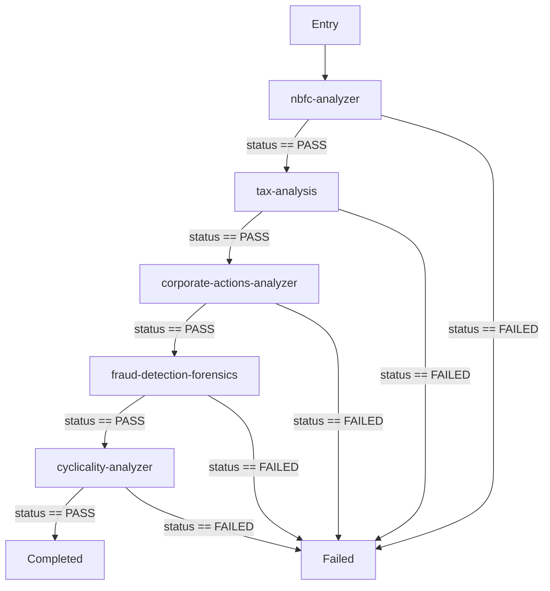

# NBFC Analysis Pipeline (COMPOSITE)

```mermaid
graph TD
  Entry --> nbfc-analyzer
  nbfc-analyzer -->|status == PASS| tax-analysis
  nbfc-analyzer -->|status == FAILED| Failed

  tax-analysis -->|status == PASS| corporate-actions-analyzer
  tax-analysis -->|status == FAILED| Failed

  corporate-actions-analyzer -->|status == PASS| fraud-detection-forensics
  corporate-actions-analyzer -->|status == FAILED| Failed

  fraud-detection-forensics -->|status == PASS| cyclicality-analyzer
  fraud-detection-forensics -->|status == FAILED| Failed

  cyclicality-analyzer -->|status == PASS| Completed
  cyclicality-analyzer -->|status == FAILED| Failed
```
