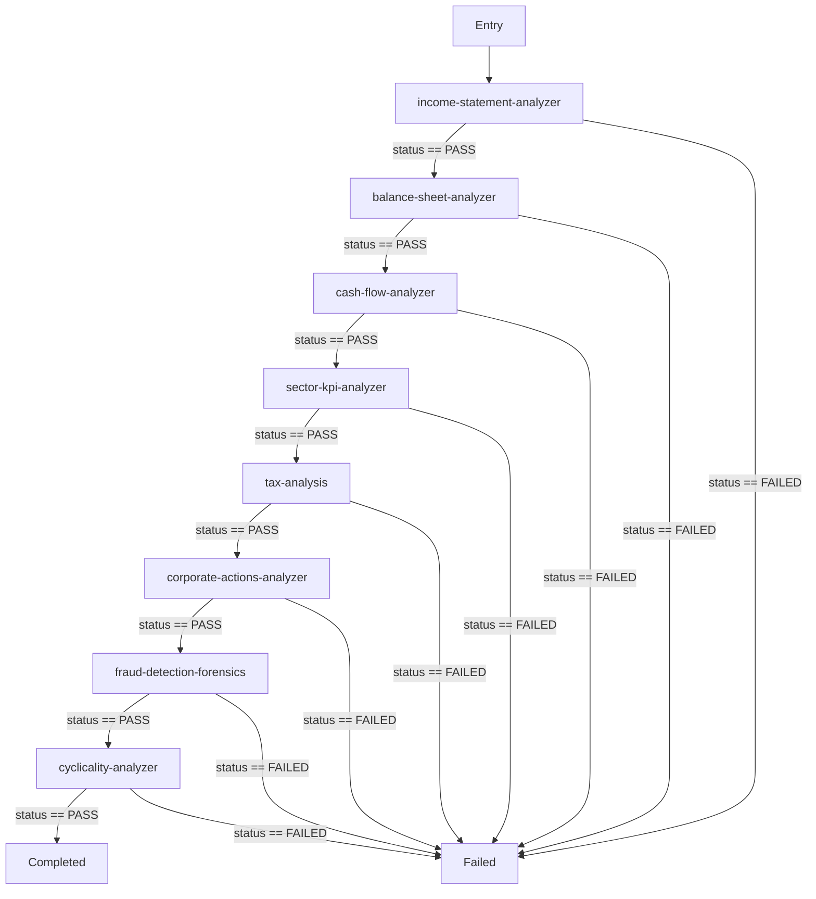

# Normal Company Analysis Pipeline (COMPOSITE)

Executes multi-statement quantitative, working capital days, cash flow conversion, segmental push/pull, and forensic auditing for corporate companies.

